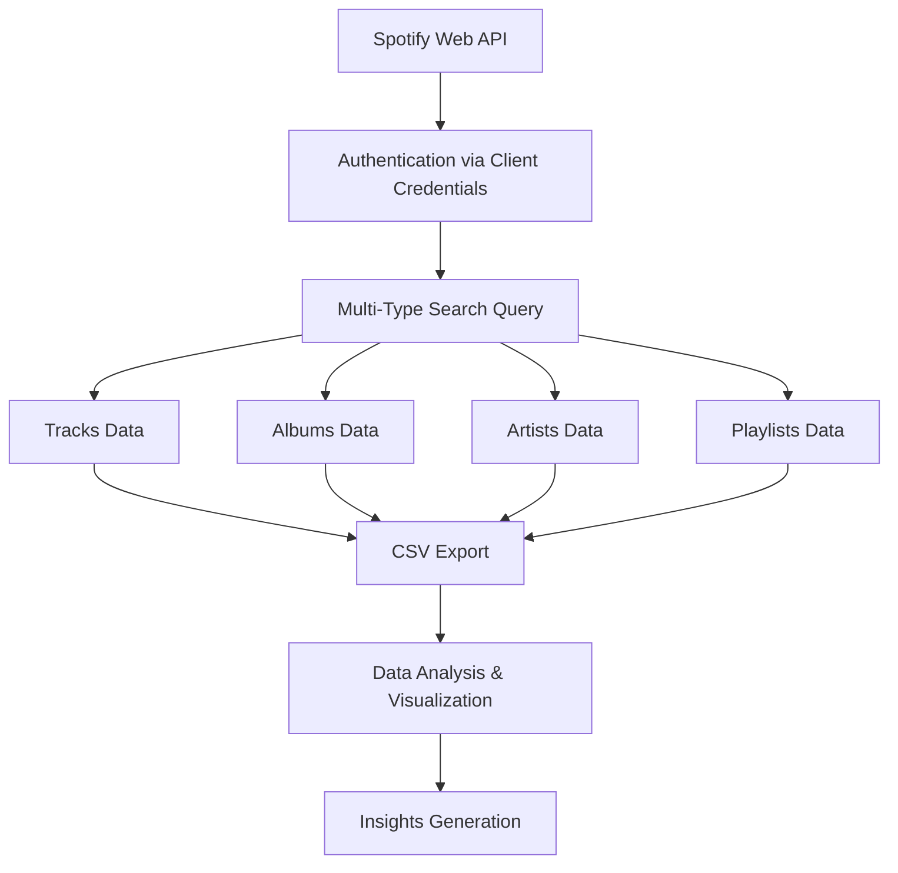

# Spotify API Analysis: Search Query Based 

## Overview
This project demonstrates a comprehensive approach to extracting, processing, and visualizing music data from Spotify's Web API. Using "Kabir Singh" as a search query, the project collects data across multiple Spotify content types and generates insightful visualizations to understand music trends and patterns.

## Project Structure
```
Kabir_Singh_Data/
├── Kabir Singh_tracks.csv
├── Kabir Singh_albums.csv
├── Kabir Singh_artists.csv
└── Kabir Singh_playlists.csv
```

## Approach & Methodology

### 1. Data Collection Strategy
The project follows a multi-dimensional data extraction approach:
- **Comprehensive Search**: Queries Spotify API across four content types (tracks, albums, artists, playlists)
- **Structured Data Extraction**: Systematically extracts relevant attributes for each content type
- **Data Persistence**: Stores all collected data in organized CSV files for further analysis

### 2. Content Type Coverage
- **Tracks**: Name, artists, album, release year, duration
- **Albums**: Name, artists, release year, total tracks
- **Artists**: Name, genres, followers, popularity score
- **Playlists**: Name, owner, track count, description

## Data Flow Architecture



### Detailed Data Flow

1. **Authentication Phase**
   - Establishes connection using Spotify Client Credentials flow
   - Secures API access with CLIENT_ID and CLIENT_SECRET

2. **Data Extraction Phase**
   - Executes parallel searches across all content types
   - Implements error handling with `.get()` methods for robust data extraction
   - Applies consistent 50-item limit for comprehensive sampling

3. **Data Processing Phase**
   - Transforms raw API responses into structured DataFrames
   - Performs data cleaning and type conversion (e.g., duration ms → seconds)
   - Handles nested data structures (artists arrays, album objects)

4. **Storage Phase**
   - Creates organized folder structure
   - Exports processed data to CSV format for persistence and shareability

5. **Analysis Phase**
   - Loads processed data for visualization
   - Generates multiple analytical perspectives through various chart types

## Visualization Strategy

### 1. Artist Popularity Analysis
- **Chart Type**: Horizontal bar chart
- **Purpose**: Identifies most frequently appearing artists in search results
- **Data Source**: Tracks data with artist name parsing


### 2. Temporal Trend Analysis
- **Chart Type**: Line plot with markers
- **Purpose**: Shows release patterns over time
- **Insight**: Reveals music industry trends and peak release periods


### 3. Duration Distribution Analysis
- **Chart Type**: Categorical bar chart
- **Purpose**: Analyzes track length preferences
- **Methodology**: Bins tracks into meaningful duration ranges


### 4. Album Comparison
- **Chart Type**: Horizontal bar chart
- **Purpose**: Compares album sizes by track count
- **Focus**: Identifies comprehensive vs. single-focused releases


### 5. Playlist Engagement Analysis
- **Chart Type**: Horizontal bar chart
- **Purpose**: Measures playlist popularity by track count
- **Application**: Understanding user curation preferences


## Technical Implementation

### Dependencies
- `spotipy`: Spotify Web API wrapper
- `pandas`: Data manipulation and analysis
- `matplotlib`: Base plotting functionality
- `seaborn`: Enhanced statistical visualizations

### Key Features
- **Robust Error Handling**: Uses `.get()` methods to prevent KeyError exceptions
- **Data Type Optimization**: Converts duration from milliseconds to seconds
- **Flexible Query System**: Easily adaptable to different search terms
- **Modular Design**: Separate data collection and analysis scripts

### Data Quality Measures
- **Null Handling**: Implements `.dropna()` for data integrity
- **Default Values**: Provides fallbacks for missing API data
- **Type Safety**: Ensures consistent data types across operations

## Usage Instructions

### 1. Setup
```bash
pip install spotipy pandas matplotlib seaborn
```

### 2. Configuration
- Obtain Spotify API credentials from [Spotify Developer Dashboard](https://developer.spotify.com/)
- Replace CLIENT_ID and CLIENT_SECRET in the script

### 3. Execution
```bash
python spotify_data_collector.py
python spotify_data_analyzer.py
```


## Extensibility

The modular design allows for easy extension:
- **Additional Queries**: Modify search terms for different analyses
- **Enhanced Metrics**: Add more Spotify API fields
- **Advanced Visualizations**: Implement correlation analysis or clustering
- **Real-time Updates**: Schedule periodic data collection

